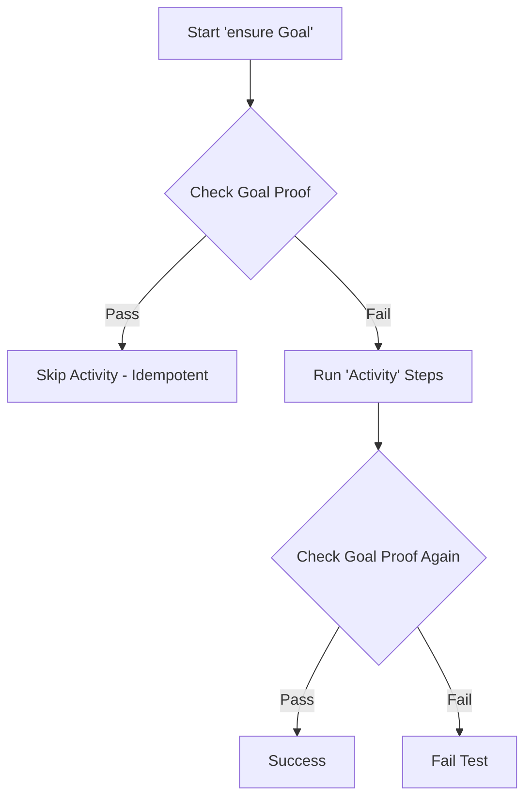

# Haibun agents guide

This document is designed for human and AI developers. It can be verified from [e2e-tests](e2e-tests/tests/features/agents-examples.feature).

## What is Haibun?

Haibun is a declarative, logic-grounded, literate orchestrator designed to unify specification, verification, and documentation in a single "executable" format.

The same file serves three purposes: defining expected behavior, verifying systems against that specification, and explaining the system to readers. All statements are reusable, built on a tested core and array of specialized steppers. Provided steppers usually wrap a widely used testing tool, such as Playwright.

> 👉 This document can be verified; lines starting with lowercase letters are steps. Run `npm test -- agents` in the e2e-tests directory to execute all examples.

## Core philosophy

### Literate programming

Documentation becomes the test; prose provides context, and executable statements verify behavior. All statements are strictly validated.

## What can be tested?

Web applications, custom systems, and other domains can be tested via a mix of reusable steppers that execute steps.

Steppers are modules that provide testing capabilities. They are configured via a config.json file, and each may have their own runtime options. Use `--help` with haibun-cli and a config.json (typically, `npm test -- --help`to see configured options).

## Core syntax

### Case sensitivity rule

**Prose** (description) lines start with **uppercase or symbols**, analogous to the objective prose of Haibun.
**Steps** statements start with **lowercase** letters, analogous to the haikus of Haibun.

    set example to "test"
    variable example is "test"

Steps can also be written as Typescript modules, analogous to kireji, identified with .feature.ts. They can be mixed with text form and are displayed in text form during execution. Kireji provides syntax checking and navigation. See [examples in e2e-tests](e2e-tests/tests/features/).

### Comments

Inline explanations use `;;`.

    set max_retries to "5" ;; allows robust retry logic

## Variables & Domains

Variables enable parameterization and reusable test configurations between environments. Domains act as **Types** (or Sets) in a formal system, defining a universe of valid values. Variables are **Terms** that must belong to a specific Domain ($x \in D$).

### Scoping

Variables and domains have Feature scope. They are maintained between activities and scenarios, and cleared between features. NB currently there is no mitigation for variable collisions and side effects. Use meaningful and specific variable names.

    set v to 1

    Activity: Demonstrate scoping
    set v to 2
    waypoint Variable changed by waypoint

    Variable changed by waypoint

    variable v is 2

### Variables

Use variables for configuration, test data, and efficiency.

    set base_url to "https://example.com"
    set timeout as number to 30

#### Stepper variables

Some steppers provide variables that are updated when steps execute. For example, `WebPlaywright.currentURI` and `WebPlaywright.navigationCount`.

### Domains (Unordered sets)

    set of roles is ["admin", "editor", "viewer"]
    set user_role as roles to "admin"

### Soundness and Validation

Haibun enforces **soundness** by preventing invalid states. A variable cannot hold a value outside its domain.

    not set user_role as roles to "guest" ;; without `not`, this would fail because "guest" is not in roles

### Built-in domains

`string`, `number`, `json`, `date`, and `page-locator`.

    set count as number to 0
    set config as json to {"enabled": true}

## Basic steps

The core verbs for manipulating state.

### Setting values

    set example to "test"

### Checking values

    variable example is "test"
    show vars ;; inspect all variables with domains and values
    show var example ;; inspect a single variable

### Incrementing (Ordered sets)

Ordered sets enable state machines and efficient waypoint checks.

    ordered set of statuses is ["draft", "review", "published"]
    set doc_status as statuses to "draft"
    increment doc_status
    variable doc_status is "review"

### Comparisons

    variable doc_status is less than "published" ;; true

## Step Arguments & Interpolation

Steps can accept arguments using `{curly_braces}`.

In Definitions: `waypoint Initialize entities for {name}` creates a variable `name` available inside the activity.

In Steps: `set published to {article}` injects the value of the variable `article`.

    set article to "Haibun Guide"
    set published to {article} ;; sets 'published' to "Haibun Guide"

## Compound statements

Compound statements combine multiple steps in one line.

### The statement domain

Many steps accept a `{statement}` parameter; a domain representing executable statments.

Compound statements use the statement domain to compose logic:

    set x to "1"
    where variable x is "1", set y to "2" ;; where accepts condition and action statements

### Examples of compound steps

- `where {condition}, {action}` - Conditional
- `whenever {condition}, {action}` - Loop
- `any of {stmt}, {stmt}, ...` - Disjunction
- `until {statements}` - Repeat until success
- `not {statement}` - Negation

## Logic & control flow

Logic steps enable complex workflows and limited conditional behavior.

### Conditionals

    set env to "staging"
    where variable env is "staging", set debug to "true"
    variable debug is "true"

### Disjunction

    set status to "Success"
    any of variable status is "Success", variable status is "Completed"

### Negation

    not variable status is "Error"

### Loops

    set counter as number to 0
    whenever variable counter is less than 3, increment counter
    variable counter is 3

## File organization

A tests folder will have a features and backgrounds subfolder, and usually one or more config.json files (config.json can be specified by cli's -c). Tests are stored in features. Test filters (by folder/filename) can be passed comma-separated as a cli argument.

Backgrounds are stored in the backgrounds folder at the same level as features. See [examples used by feature tests](e2e-tests/tests/backgrounds/).

### Backgrounds

Backgrounds are reusable steps that can be explicitly invoked with `Backgrounds: flows/login, flows/portal`, etc. It can become unweildy to manage many backgrounds, so using activities and waypoints may be preferred.

## Activities & waypoints

Activities and waypoints enable reusable goal-oriented, idempotent tests. They are best stored in backgrounds, where they will be discovered without explicit imports (missing waypoints or duplicate naming results in errors).

NB The ensure pattern guarantees prerequisites, not outcomes. Use ensure to establish the starting state required for a test (e.g. auth or database setup). Avoid using ensure to enforce the primary behavior under test, as it may obscure failure logic by "correcting" it.

NB Activities in a feature will run inline, without being called by a waypoint. Generally, activities should be stored in backgrounds.

### Defining activities

Activities represent high-level goals or workflows.

    Activity: Initialize System
    set system_ready to "false"
    set system_ready to "true"
    waypoint System is ready with variable system_ready is "true"

### Waypoints as goals

Waypoints define verifiable goals with proof steps.

    Activity: Setup Database
    set db_ready to "false"
    set db_ready to "true"
    waypoint Database is initialized with variable db_ready is "true"

### Using ensure

Verifies the waypoint's proof.

If the proof passes: skip the activity (efficiency).
If the proof fails: run the activity, then re-check the proof.

    ensure System is ready
    ensure Database is initialized

    show waypoints ;; see all verified waypoints

## Usage patterns

NB these tests use variables for proofs, in a "live" system they might rely on API endpoints or browser elements.

### Domain-driven workflows

    ordered set of Ticket states is ["open", "assigned", "resolved", "closed"]
    set ticket as Ticket states to "open"

    Activity: Process ticket
    whenever variable ticket is less than "closed", increment ticket
    waypoint Ticket is closed with variable ticket is "closed"

    ensure Ticket is closed

### Parameterized tests

    set API Endpoint to "api.staging.example.com"
    set API Timeout as number to 5000

    Activity: API health check
    set API Status to "false"
    set API Status to "true"
    waypoint API responds with variable API Status is "true"

    ensure API responds

## Common patterns

### Pattern 1: Idempotent setup

    Activity: Environment setup
    set Environment configured to "false"
    set Environment configured to "true"
    waypoint Environment is configured with variable Environment configured is "true"

    ensure Environment is configured

### Pattern 2: Efficient state checks

    ordered set of Approval stages is ["draft", "reviewed", "approved"]
    set Document stage as Approval stages to "draft"

    Activity: Approve document
    whenever variable Document stage is less than "approved", increment Document stage
    waypoint Document is at least reviewed with not variable Document stage is less than "reviewed"

    Checks for minimum required state (at least "reviewed"), not exact state.

    ensure Document is at least reviewed ;; activity increments to "approved", proof passes
    variable Document stage is "approved" ;; verify the activity ran to completion

### Pattern 3: Parameterized workflows

    Activity: Publish article
    set published to {article}
    waypoint Article {article} is published with variable published is {article}

    ensure Article "Writing haibuns" is published

### Pattern 4: Dynamic domains

A talent agency can have different types of clients, including artists and venues. Each client has different considerations, such as if they are signed or advertised. The artist has to agree to each of these states.

    set of offer is ["signed", "advertised", "popular"]
    set name to "Example"
    set concern to "signed"

    Activity: Engage a client
    every state in offer is ordered set of {name}/{state} is ["negotiating", "agreed"]
    every state in offer is set {name}/{state} as {name}/{state} to "negotiating"
    waypoint Engaged {name} with every state in offer is variable {name}/{state} is set

    Activity: Foster a client
    increment {name}/{concern}
    show var {name}/{concern}
    waypoint {name} agreed with {concern} with not variable {name}/{concern} is less than "agreed"

show waypoints
    ensure Engaged "Theatre Z"
    ensure Engaged Le Artiste
    ensure "Le Artiste" agreed with signed

    variable Theatre Z/signed is "negotiating"
    variable Le Artiste/signed is "agreed"
    variable Le Artiste/popular is "negotiating"

## Next steps

Examples are available in [e2e-tests](e2e-tests/tests/features/).
