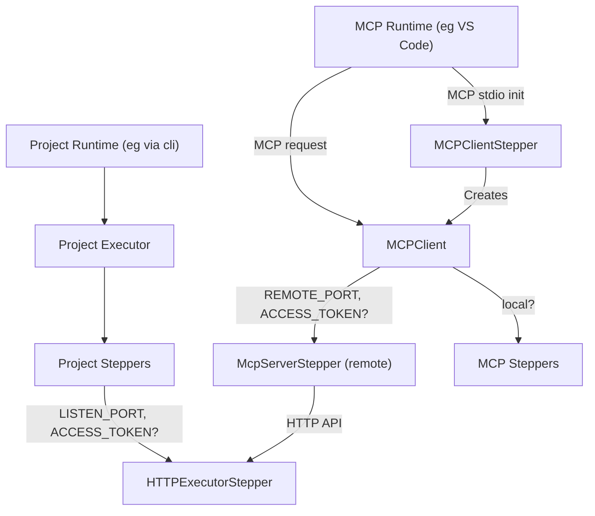

# Haibun MCP Module

Enables agents to interact with Haibun steppers through the standardized [Model Context Protocol (MCP)](https://modelcontextprotocol.io/).


## Quick Start

### 1. Run example external HTTP executor

```bash

./run-mcp-with-monitor.sh

```

### 2. VS Code MCP Configuration

Add to your VS Code `mcp.json`:

```json
{
 "servers": {
	"haibun-mcp": {
		"type": "stdio",
		"command": "node",
		"cwd": "<project base>/node_modules/@haibun/modules",
		"args": [
			"./cli/build/cli.js",
			"-c",
			"./mcp/runtime/agent/config.json",
			"./mcp/runtime/agent"
		],
		"env": {
			"HAIBUN_O_MCPSERVERSTEPPER_REMOTE_PORT": "8125",
			"HAIBUN_O_MCPSERVERSTEPPER_ACCESS_TOKEN": "localTest",
			"HAIBUN_O_WEBPLAYWRIGHT_STORAGE": "StorageMem"
		},
		"dev": {
			"watch": "modules/**/build/**/*.js",
			"debug": {
				"type": "node"
			}
		}
	},
}
```


## Architecture

### Overview


## Configuration

| Environment Variable                        | Description                     |
| ------------------------------------------- | ------------------------------- |
| `HAIBUN_O_MCPSERVERSTEPPER_REMOTE_PORT`     | Connect to remote HTTP executor |
| `HAIBUN_O_MCPSERVERSTEPPER_ACCESS_TOKEN`    | Remote executor auth token      |
| `HAIBUN_O_HTTPEXECUTORSTEPPER_LISTEN_PORT`  | HTTP API port (e.g., 8125)      |
| `HAIBUN_O_HTTPEXECUTORSTEPPER_ACCESS_TOKEN` | HTTP API auth token             |
