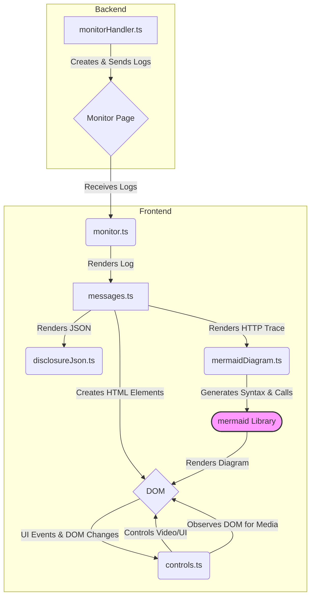

```mermaid
graph TD
    subgraph Backend
        A[monitorHandler.ts]
        A -- Creates & Sends Logs --> B
    end

    subgraph Frontend
        B{Monitor Page}
        B -- Receives Logs --> C(monitor.ts)
        C -- Renders Log --> D[messages.ts]
        D -- Renders JSON --> E(disclosureJson.ts)
        D -- Renders HTTP Trace --> F(mermaidDiagram.ts)
        F -- Generates Syntax & Calls --> G([mermaid Library])
        D -- Creates HTML Elements --> H{DOM}
        H -- UI Events & DOM Changes --> I(controls.ts)
        I -- Controls Video/UI --> H
        I -- Observes DOM for Media --> H
        G -- Renders Diagram --> H
    end

    style G fill:#f9f,stroke:#333,stroke-width:2px
```
